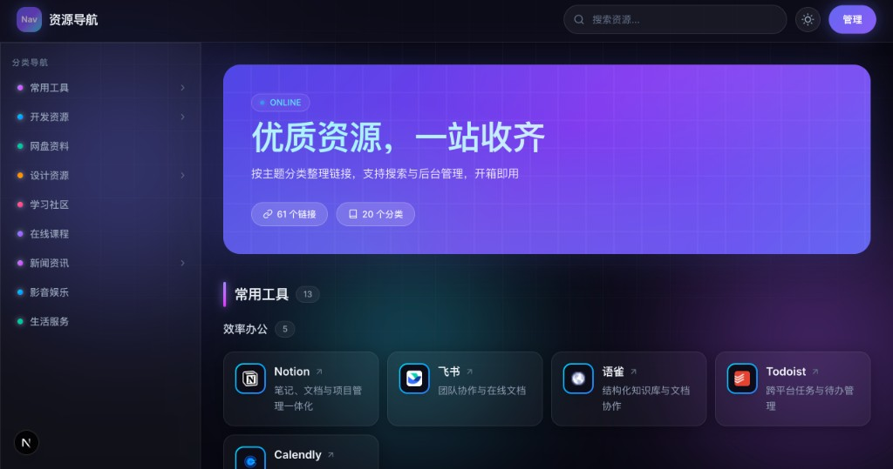
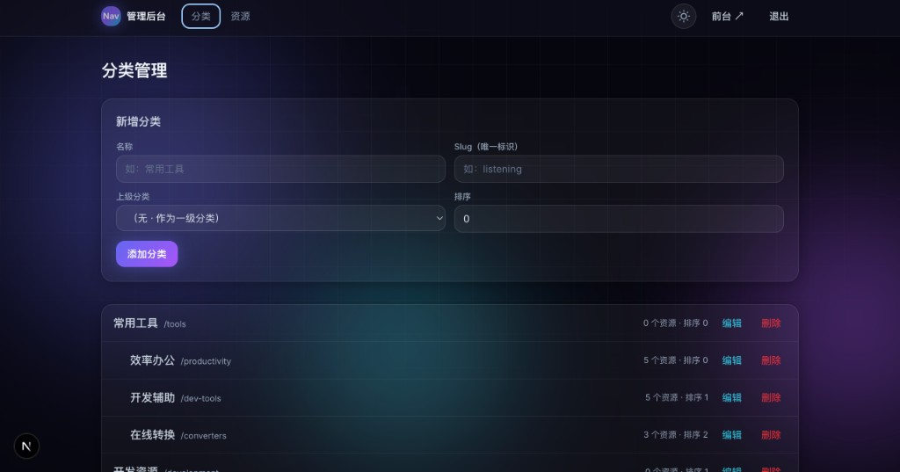
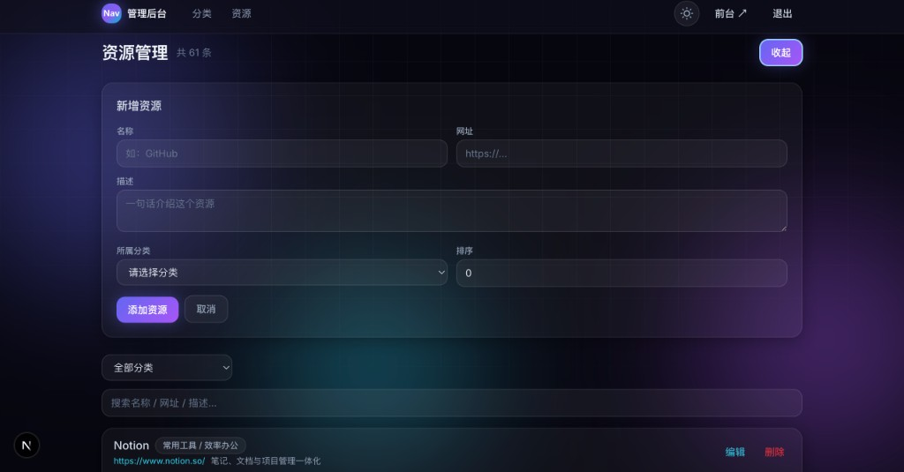

# 资源导航站

一个开箱即用的**网站链接导航**模板。把常用网站按分类整理好，访客可以浏览、搜索；你可以在后台随时增删改，不用改代码。

适合：个人书签、工具合集、行业导航、团队资源库等。

---

## 效果预览

### 前台

左侧分类导航 + 右侧资源卡片，支持搜索、深色模式，网站图标自动显示。



### 后台

登录后可可视化管理分类和链接，无需改代码或操作数据库。

| 分类管理 | 资源管理 |
| --- | --- |
|  |  |

---

## 你能得到什么

| 页面 | 地址 | 说明 |
| --- | --- | --- |
| 前台 | `/` | 分类展示、搜索、深色模式 |
| 后台 | `/admin` | 登录后管理分类和链接 |

---

## 开始之前

请先在电脑上安装：

- **Node.js 20 或更高版本**（[下载地址](https://nodejs.org/)）
- 任意代码编辑器（推荐 [VS Code](https://code.visualstudio.com/)）

安装完成后，打开终端（Mac 用「终端」，Windows 用「PowerShell」），输入下面命令检查是否成功：

```bash
node -v
npm -v
```

能显示版本号就说明安装好了。

---

## 本地运行（4 步）

### 第 1 步：克隆代码

```bash
git clone https://github.com/knowledgefxg/resource-nav.git
cd resource-nav
```

### 第 2 步：安装依赖

```bash
npm install
```

第一次会下载一些包，等一两分钟是正常的。

### 第 3 步：配置环境变量（可选但建议）

```bash
cp .env.example .env.local
```

按需修改 `.env.local` 里的网站名称、密码等（详见下方「改网站名字、密码等」）。本地试用可暂时跳过，使用默认配置。

### 第 4 步：启动

```bash
npm run dev
```

看到 `Ready` 后，用浏览器打开：

- 前台：http://localhost:3000
- 后台：http://localhost:3000/admin
- 默认密码：`admin123`

按 `Ctrl + C` 可以停止服务。

> 首次启动会自动创建数据库，并写入一批演示数据（如图中所示的分类和链接），直接就能看到效果。

---

## 改网站名字、密码等

### 1. 复制配置文件

```bash
cp .env.example .env.local
```

Windows PowerShell 用：

```powershell
copy .env.example .env.local
```

### 2. 用编辑器打开 `.env.local`，按需修改

| 配置项 | 是干什么的 | 示例 |
| --- | --- | --- |
| `SITE_NAME` | 网站名称（顶栏显示） | `我的导航` |
| `SITE_DESCRIPTION` | 搜索引擎看到的简介 | 一句话介绍你的网站 |
| `SITE_HERO_TITLE` | 首页大标题 | `优质资源，一站收齐` |
| `SITE_HERO_SUBTITLE` | 首页副标题 | 任意描述文字 |
| `SITE_LOGO` | 左上角小图标文字（1～3 字） | `Nav` |
| `SITE_FOOTER` | 页脚文字 | `我的导航站` |
| `ADMIN_PASSWORD` | 后台登录密码 | **上线前务必改掉** |
| `AUTH_SECRET` | 登录会话密钥 | **上线前务必改掉**（随便一长串字母数字即可） |
| `SHOW_ADMIN_LINK` | 前台是否显示「管理」按钮 | 生产环境建议 `false` |

改完后**重启** `npm run dev` 才会生效。

> 注意：只改 `.env.example` 不会生效，必须改 `.env.local`。

### 3. 改初始演示数据（可选）

也可以直接编辑 `src/lib/seed.ts`，修改第一次启动时写入的分类和链接。

---

## 后台怎么用

登录地址：http://localhost:3000/admin

### 分类管理

路径：`/admin/categories`


填写说明：

| 字段 | 说明 | 示例 |
| --- | --- | --- |
| **名称** | 给用户看的中文名 | `常用工具` |
| **Slug** | 英文唯一标识，列表里显示为 `/tools` | `tools` |
| **上级分类** | 不选则作为一级分类 | — |
| **排序** | 数字越小越靠前 | `0` |

列表中「常用工具 `/tools`」表示：名称是「常用工具」，Slug 是 `tools`。子分类会缩进显示，并显示该分类下的资源数量。

### 资源管理

路径：`/admin/resources`


填写说明：

| 字段 | 说明 | 示例 |
| --- | --- | --- |
| **名称** | 网站名称 | `Notion` |
| **网址** | 完整链接 | `https://www.notion.so/` |
| **描述** | 一句话介绍 | `笔记、文档与项目管理一体化` |
| **所属分类** | 选择分类 | `常用工具 / 效率办公` |
| **排序** | 数字越小越靠前 | `0` |

添加后前台会自动显示，卡片图标会根据网址域名自动获取，无需手动上传。

顶部可按分类筛选，也可用搜索框按名称、网址、描述查找。

---

## 数据存在哪

所有数据保存在项目里的 `data/app.db` 文件中（SQLite 数据库，无需额外安装数据库软件）。

- 后台的修改都会写到这里
- 想恢复成初始演示数据：删掉 `data/app.db`，再重新 `npm run dev`

---

## 部署到服务器（简要）

本地能跑通之后，若要让别人通过互联网访问，需要一台支持 **Node.js** 的服务器（云服务器 VPS 等）。网上教程还是很多的，根据个人需求来吧。

### 上线前必做

1. 在 `.env.local`（或服务器环境变量）里改掉 `ADMIN_PASSWORD` 和 `AUTH_SECRET`
2. 建议设置 `SHOW_ADMIN_LINK=false`（管理员直接访问 `/admin` 即可）

### 服务器上大致流程

```bash
npm install
npm run build
npm run start
```

默认运行在 3000 端口，前面通常再加 Nginx 做域名和 HTTPS。

### 不适合的平台

- **SiteGround 等纯 PHP 虚拟主机**：不支持 Node.js，无法直接跑本项目
- **Vercel 等 Serverless**：SQLite 文件不好持久保存，需要换数据库方案

更稳妥的方式：用 **VPS + PM2 + Nginx**，或 **Docker** 部署，并保证 `data/` 目录持久化。

---

## 常见问题

**Q：`npm install` 报错，提到 `better-sqlite3`？**  
A：这是数据库组件，需要编译。Mac 一般没问题；Windows 可安装 [Visual Studio Build Tools](https://visualstudio.microsoft.com/visual-cpp-build-tools/)；Linux 需要 `python3`、`make`、`g++`。

**Q：改了 `.env.local` 没变化？**  
A：确认文件名是 `.env.local` 而不是 `.env.example`，改完后重启 `npm run dev`。

**Q：忘记后台密码？**  
A：改 `.env.local` 里的 `ADMIN_PASSWORD`，重启服务后使用新密码登录。

**Q：Slug 是什么？**  
A：分类的英文唯一 ID，例如「常用工具」对应 `tools`。全站不能重复，用小写字母和连字符即可。

**Q：图标是怎么来的？**  
A：根据链接的域名，自动从 Google 图标服务获取网站 favicon，无需手动配置。

---

## 技术栈（给开发者参考）

- Next.js 16（App Router + Server Actions）
- React 19 + Tailwind CSS 4
- SQLite（better-sqlite3，零配置）
